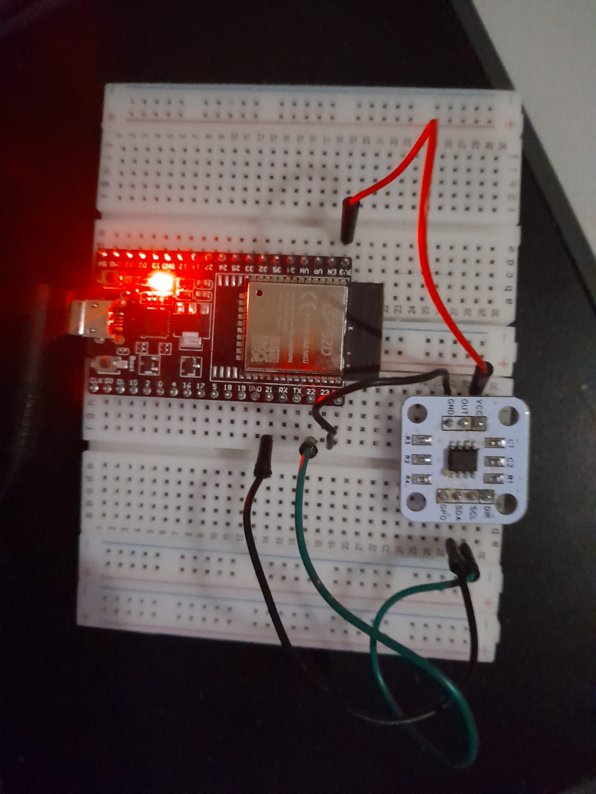
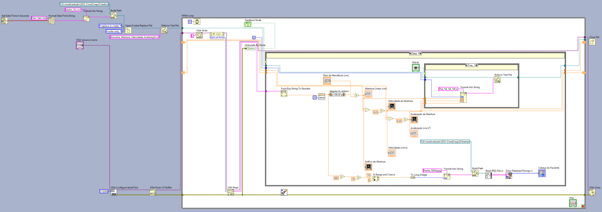

# Sistema de Monitoramento Biomecânico Mandibular com Sensor Magnético AS5600

## 📋 Sobre o Projeto

A análise biomecânica da mandíbula é fundamental para o diagnóstico de disfunções temporomandibulares (DTM) e planejamento de reabilitações orais. No entanto, métodos tradicionais muitas vezes carecem de precisão ou envolvem alto custo.

Este projeto consiste em uma plataforma de instrumentação virtual para analisar o movimento da articulação temporomandibular (ATM). O sistema integra o microcontrolador **ESP32** e o sensor magnético de alta precisão **AS5600** com o software **LabVIEW**.

O dispositivo permite capturar, processar e registrar o movimento mandibular em tempo real, convertendo deslocamentos angulares em grandezas lineares, velocidade e aceleração, oferecendo uma abordagem não invasiva e acessível para aplicações de engenharia e diagnósticos clínicos.

## 🎯 Objetivos

O objetivo principal é desenvolver um sistema de instrumentação virtual de baixo custo para o monitoramento cinemático da ATM em tempo real.

**Objetivos Específicos:**
* **Hardware:** Instrumentação com sensor AS5600 (I2C) e ESP32 via comunicação Serial.
* **Algoritmos:** Conversão matemática de angular para linear e cálculo de derivadas (velocidade e aceleração).
* **Interface (IHM):** Visualização em gráficos de forma de onda e animação 3D sincronizada.
* **Datalogging:** Registro automático de dados em `.csv` para pós-análise.

## ✨ Funcionalidades

* **Sensor Sem Contato:** Utiliza codificador magnético absoluto, evitando desgaste físico.
* **Comunicação Serial:** Transmissão de dados via USB (UART) de alta velocidade.
* **Processamento em Tempo Real:** Filtragem e conversão matemática instantânea.
* **Animação 3D:** *Picture Ring* no LabVIEW sincronizado frame-a-frame com o sensor.
* **Parametrização:** Ajuste dinâmico do "Raio da Mandíbula" para diferentes pacientes (adultos/crianças).

## 🛠️ Especificações Técnicas

### Hardware

| Parâmetro | Especificação |
| :--- | :--- |
| **Microcontrolador** | ESP32 (Espressif Systems) - Dual Core 240MHz |
| **Sensor de Posição** | AS5600 (AMS) - Encoder Magnético 12-bits |
| **Resolução** | 0.0879 graus (4096 posições) |
| **Protocolo** | I2C (Inter-Integrated Circuit) |
| **Tensão** | 3.3V DC |
| **Taxa de Amostragem** | Configurável (Serial Baud Rate: 115200) |

### Pinagem (Conexões ESP32)

* **VCC:** 3.3V
* **GND:** GND
* **SDA (Dados):** GPIO 21
* **SCL (Clock):** GPIO 22

## 📐 Lógica Matemática e Física

O sistema converte o deslocamento angular ($\theta$) lido pelo sensor em deslocamento linear do arco mandibular ($S$), baseado no raio ($R$) configurado pelo usuário:

$$S = \theta_{(rad)} \times R_{(cm)}$$

Além da posição, o sistema calcula as derivadas físicas para análise clínica:
1.  **Velocidade ($v$):** $\frac{ds}{dt}$ (cm/s)
2.  **Aceleração ($a$):** $\frac{d^2s}{dt^2}$ (cm/s²) - Permite identificar picos de força e tremores.

## 💻 Interface do Usuário (LabVIEW)

### Painel Frontal
O painel permite a visualização da simulação 3D e dos gráficos de cinemática (Abertura, Velocidade e Aceleração).

### Diagrama de Blocos
Lógica de programação G-Code demonstrando aquisição VISA, processamento matemático e escrita de arquivos.

### 📈 Curvas Típicas de Operação

O sistema é capaz de capturar detalhadamente a cinemática do movimento mandibular. Abaixo, apresenta-se a resposta típica do sistema durante um ciclo completo de abertura e fechamento.

**Análise dos Gráficos:**
1.  **Abertura (Posição):** Observa-se o movimento linear suave de abertura até o pico máximo e o retorno à posição de repouso.
2.  **Velocidade:** Apresenta patamares constantes durante o movimento contínuo, indicando estabilidade na execução.
3.  **Aceleração:** O gráfico exibe picos característicos ("spikes") nos momentos de início e fim do movimento. Estes impulsos correspondem fisicamente à quebra de inércia e à inversão do sentido do movimento, validando a precisão da derivada numérica calculada pelo algoritmo.

## ✅ Conclusão

O projeto resultou em um sistema funcional e estável. A utilização do LabVIEW possibilitou a visualização em tempo real e o tratamento matemático complexo dos sinais. O hardware demonstrou estabilidade na leitura angular sem contato, eliminando ruídos mecânicos. O sistema entrega uma solução completa, desde a captura física até a geração de relatórios CSV.

## 👥 Autores

* **Gabriela Benedito Jose dos Santos Moreira**
* **Terencio Francisco Lira Ribeiro**

**Instituição:** Instituto Federal de Educação, Ciência e Tecnologia do Sudeste de Minas Gerais - Campus Juiz de Fora.
**Curso:** Engenharia Mecatrônica.

---
*Este projeto foi desenvolvido como parte da disciplina de Instrumentação II (2025-2).*
